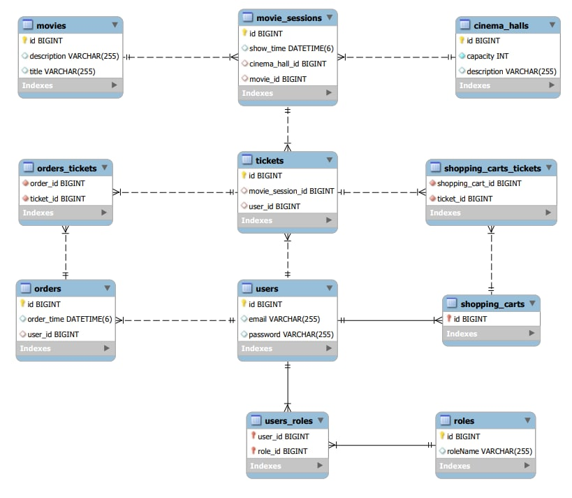

# :cinema: cinema-project :ticket:


It is a web application that supports the possibility of purchasing a movie ticket and includes such functionality as registration, authentication, role authorization and CRUD operations.

The project is based on Spring and Hibernate frameworks. Spring provides life management beans (Dao, Services), encrypts user passwords and manages access for each role. Hibernate is responsible for mapping the entity to and from the table to the corresponding object.
## Used technologies
- Java 11 
- Maven 
- Apache Tomcat
- MySQL
- Spring Core
- Spring MVC
- Spring Security
- Hibernate
## API architecture
The project_cinema based on a 3-tier architecture
- DAO layer: for works with database
- controllers layer: for handling requests and responses
- service layer: include business logic



## Launching the project locally:
1. Clone this project 
2. Create database locally using MySQL
3. In db.properties file write your credentials: database driver, url, username, password 
4. Configure TomCat using `/` as your application context path.
5. Run the application with Tomcat
## What can you do
You already have two registered users: `admin@i.ua` password: `admin123` with admin role and `bob@i.ua` password: `bob123` with user role. 

You can also additionally register new users through Postman and perform the following operations:

```
[POST]   /register - registers a new user
[POST]   /cinema-halls - creates a new cinema hall
[GET]    /cinema-halls - returns all cinema halls
[POST]   /movies - creates a new movie
[GET]    /movies - returns all movies
[POST]   /movie-sessions - creates a new movie session
[GET]    /movie-sessions/available - returns all available movie sessions for the selected movie
[PUT]    /movie-sessions/{id} - updates a movie session
[DELETE] /movie-sessions/{id} - deletes a movie session
[POST]   /orders/complete - completes an order
[GET]    /orders - returns order history of user
[PUT]    /shopping-carts/movie-sessions - adds a movie session to shopping cart
[GET]    /shopping-carts/by-user - returns shopping cart of logged user
[GET]    /users/by-email - returns user by email```